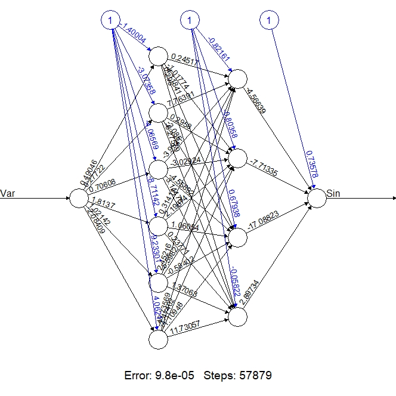
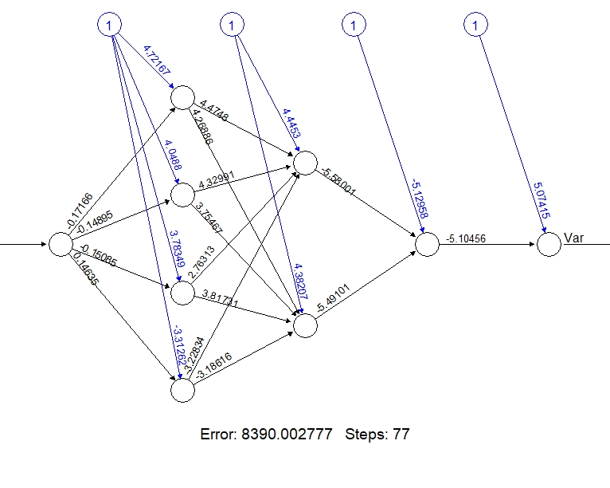

Statement of contribution: Assignment 1 was contributed mostly by Ravinder, assignment 2 by Otto and assignment 3 by Hoda.


# 1. Assignment 1 -
```{r,include=FALSE}
################################
#Assignment 1
################################
```
## 1.1


# 2. Assignment 2 - Support Vector Machines
```{r,include=FALSE}
################################
#Assignment 2
################################
```
This assignments consists of running the code from the provided file **Lab3Block1_2020_SVMs.R** and answering questions about the models. The code from the file is displayed below:
```{r, eval=FALSE}
# Lab 3 block 1 of 732A99/TDDE01 Machine Learning
# Author: jose.m.pena@liu.se
# Made for teaching purposes

library(kernlab)
set.seed(1234567890)

data(spam)

index <- sample(1:4601)
tr <- spam[index[1:3000], ]
va <- spam[index[3001:3800], ]
trva <- spam[index[1:3800], ]
te <- spam[index[3801:4601], ]

by <- 0.3
err_va <- NULL
for(i in seq(by,5,by)){
  filter <- ksvm(type~.,data=tr,kernel="rbfdot",kpar=list(sigma=0.05),C=i)
  mailtype <- predict(filter,va[,-58])
  t <- table(mailtype,va[,58])
  err_va <-c(err_va,(t[1,2]+t[2,1])/sum(t))
}

filter0 <- ksvm(type~.,data=tr,kernel="rbfdot",kpar=list(sigma=0.05),C=which.min(err_va)*by)
mailtype <- predict(filter0,va[,-58])
t <- table(mailtype,va[,58])
err0 <- (t[1,2]+t[2,1])/sum(t)
err0

filter1 <- ksvm(type~.,data=tr,kernel="rbfdot",kpar=list(sigma=0.05),C=which.min(err_va)*by)
mailtype <- predict(filter1,te[,-58])
t <- table(mailtype,te[,58])
err1 <- (t[1,2]+t[2,1])/sum(t)
err1

filter2 <- ksvm(type~.,data=trva,kernel="rbfdot",kpar=list(sigma=0.05),C=which.min(err_va)*by)
mailtype <- predict(filter2,te[,-58])
t <- table(mailtype,te[,58])
err2 <- (t[1,2]+t[2,1])/sum(t)
err2

filter3 <- ksvm(type~.,data=spam,kernel="rbfdot",kpar=list(sigma=0.05),C=which.min(err_va)*by)
mailtype <- predict(filter3,te[,-58])
t <- table(mailtype,te[,58])
err3 <- (t[1,2]+t[2,1])/sum(t)
err3
```
## Questison 1: Which filter do we return to the user? filter0, filter1, filter2 or filter3? Why?
We want our final model, the one we return to the user, to be as good as possible. As such we want it to have access to as much data as possible so that it can use more information while training. Therefore the filter we return to the user should be filter3, as the parameter "data=spam" shows that it was trained on the entire data set.

## Questison 2: What is the estimate of the generalization error of the filter returned? err0, err1, err2 or err3? Why?
While one might think that since we're returning filter3 we should also return the error calculated on filter3, this would be incorrect. The idea behind the error is that it should show what sort of error we can expect when the model is used to predict new data, i.e. data that was not used to train the model, as this is going to be the situation when the model is implemented by the user. As filter3 was trained with all of our data, the test data was also included for training. Therefore an error calculated based on the test data will not be accurate but will instead likely underestimate the error of our model. The error that should be reported is err1. This is because filter1 was trained only on the training data and then tested on the test data. This error will likely be higher than err3, but will be a better reflection of how our filter will actually perform.

# 3. Assignment 3 - NEURAL NETWORKS
```{r, include=FALSE}
################################
#Assignment 3
################################
```


## 3. *Train a neural network to learn the trigonometric sine function. To do so, sample 500 points uniformly at random in the interval $\left[ {0,10} \right]$. Apply the sine function to each point. The resulting pairs are the data available to you. Use 25 of the 500 points for training and the rest for test.Use any number of layers and hidden units that you consider appropriate. You do not need to apply early stopping.*

### *a)Plot the training and test data, and the predictions of the learned NN on the test data. You should get good results. Comment your results.* 

First, we initialized the weights randomly to almost-zero values ,in order to avoid updating them in the same way.

```{r, warning=FALSE,message=FALSE}
library(neuralnet)
set.seed(1234567890)
Var <- runif(500, 0, 10)
mydata <- data.frame(Var, Sin=sin(Var))
tr <- mydata[1:25,] # Training
te <- mydata[26:500,] # Test
# Random initialization of the weights in the interval [-1, 1]
set.seed(1234567890)
winit <- runif(301, -1, 1)
set.seed(1234567890)
hidUnit <- c(6,4)
# Train a Neural Network
set.seed(1234567890)
nn <- neuralnet(Sin ~Var,data = tr,hidden=hidUnit,
                startweights = winit,learningrate = 0.001,
                threshold = 1e-4)
#plot(nn)

```


2 hidden layer has been used. 6 hidden unit in the first latent layer and 4 hidden unit in the second latent unit. The Error of the model is very small , $9.8\mathrm{e}{-5}$.

{width=80%}


\newpage

```{r}
# Plot of the training data (black), test data (blue), and predictions (red)
plot(tr, cex=2,main='train vs test vs pred',pch = 21,bg="darkgrey",
     xlab="X",ylab="Sin(X)")
points(te, col = "cyan3", cex=1,pch = 21,bg="cyan")
points(te[,1],predict(nn,te), col="darkred",bg="red", cex=1,pch=21)

legend("bottomleft", legend=c("train","truth value of test","predicted on test"),
       pch=c(16,16,16),col = c("darkgrey","cyan3","red"),
       cex = 0.65,bty = "n")

```

As seen in the graph, our model performs well, and predicts the test data with only a slight error. 
### b) *Then, sample 500 points uniformly at random in the interval $\left[ {0,20} \right]$, and apply the sine function to each point. Use the previously learned NN to predict the sine function value for these new 500 points. You should get mixed results. Plot and comment your results.*


```{r}

set.seed(1234567890)
Var2 <- runif(500, 0, 20)
mydata2 <- data.frame(Var=Var2, Sin=sin(Var2))
plot(mydata2, cex=2,main='predict the sine function for [0,20]',pch = 21,bg="darkgrey",
     xlab="X",ylab="Sin(X)",ylim=c(-1.5,1))
points(mydata2[,1],predict(nn,mydata2), col="darkred", cex=1,pch=21,bg="red")

legend("bottomleft", legend=c("true","predicted"), pch=c(16,16),col = 
         c("darkgrey","red"),cex = 0.65,bty = "n")
```

From the graph, we can see that the our neural network has only been successful in predicting values of $x$ between $\left[ {0,10} \right]$ and  clearly has not learned the general shape of $\sin x$ for $x$ between $\left[ {10,20} \right]$. This shows the network will not generalize to examples outside of the training set. Early stopping technique , could help the network avoid overfitting on the training data, which will result in a better generalization.

### c) *Finally, sample 500 points uniformly at random in the interval $\left[ {0,10} \right]$, and apply the sine function to each point. Use all these points as training points for learning a NN that tries to predict $x$ from $\sin x$, i.e. unlike before when the goals was to predict $\sin x$ from x. You should get bad results. Plot and comment your results*

The network architecture :
```{r}
set.seed(1234567890)
Var3 <- runif(500, 0, 20)
mydata3 <- data.frame(Sin=sin(Var3),Var=Var3)
set.seed(1234567890)
winit <- runif(5500, -1, 1)
#hidUnit <- c(9,1)
set.seed(1234567890)
nn3 <-neuralnet(formula = Var~Sin,data = mydata3,
                hidden =c(4,2,1),startweights =winit,
              learningrate = 0.01,act.fct = "tanh")


```
In this task, the data to be learned is sequential and a feedforward neural network does not work for sequential or time-dependent data. Furthermore, in this example, we are trying to predict infinitely many x values from one sin(x) value. As a result, what we are trying to predict is not a function. A function maps every x value to exactly one y value. In this case, there are theoretically infinitely many values that x can take on for every sin(x) we feed into the function. The domain of arcsin(x) is only from -1 to 1 and the range is from $-\pi/2$ to $\pi/2$ radians (not from 0 to 20). All these cause to poor prediction. One solution might be to constrain $x$ values to  $-\pi/2$ to $\pi/2$



```{r}
plot(mydata3, cex=2,main='Predicting x from Sin(x)',
     pch = 21,bg="darkgrey",
     ylab="X",xlab="Sin(X)")
points(mydata3[,1],predict(nn3,mydata3), col="darkred", 
       cex=1,pch=21,bg="red")

legend("bottomleft", legend=c("true","predicted"), pch=c(21,21),
       col = c("darkgrey","red"),cex = 0.65,bty = "n")
```


\newpage
# Appendix:

```{r ref.label = knitr::all_labels(), echo=TRUE, eval=FALSE}
```
